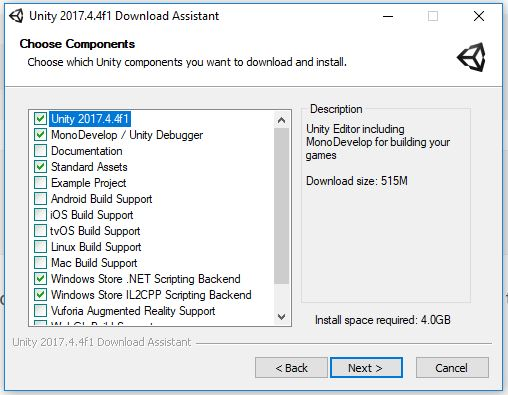
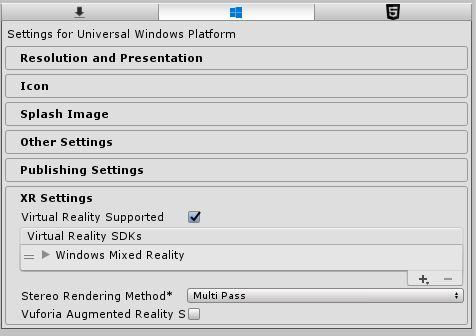
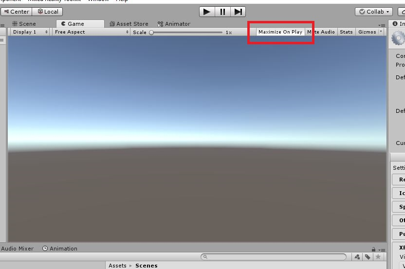
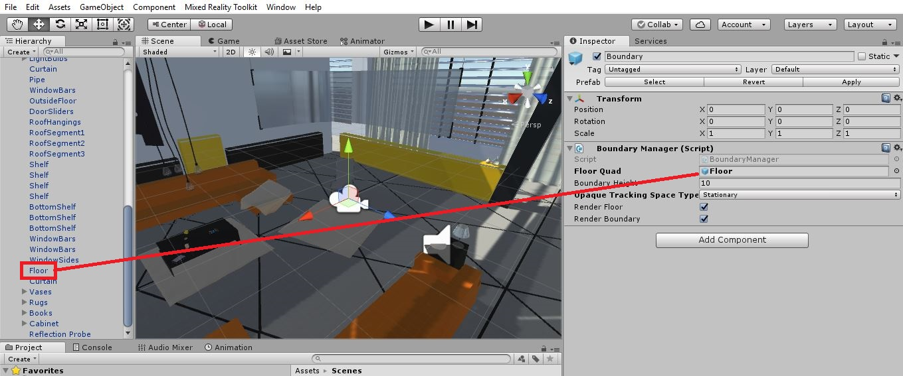
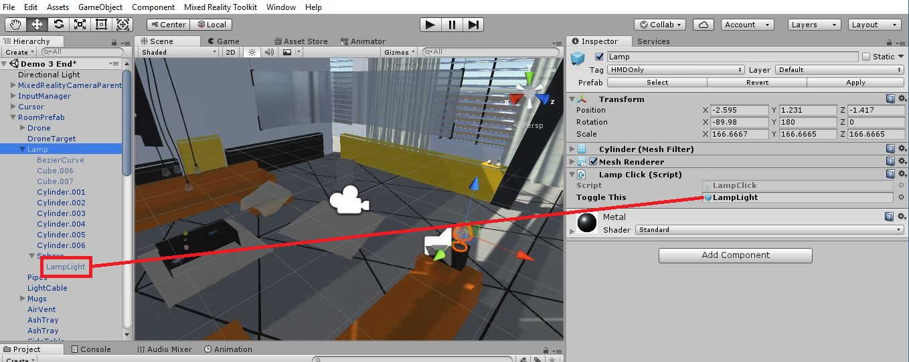
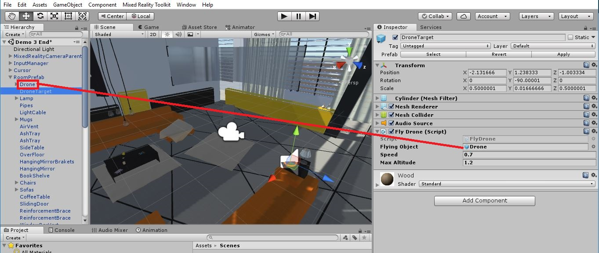
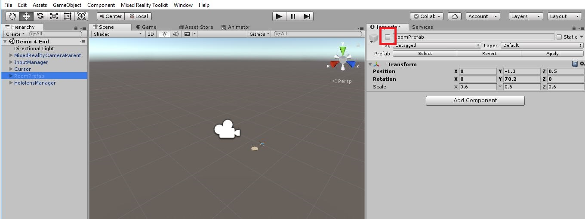

# Build Windows Mixed Reality Apps

## Prerequisites:
- Windows MR supported [PC](https://support.microsoft.com/en-us/help/4039260/windows-10-mixed-reality-pc-hardware-guidelines)
- Windows MR headset and controllers
- Windows 10 April 2018 Update
- Visual Studio 2017 (15.7.1 or higher) (Community works great)
- Universal Windows Platform development workload with Windows 10 SDK (10.0.17134.0)
- [Unity 2017](https://unity3d.com/unity/qa/lts-releases?version=2017.4)

When installing Unity make sure to check the boxes for the components shown below.

   

## Pre-Demo Setup:

### Windows Mixed Reality
1. Plug in your headset, the Mixed Reality Portal should start up. Make sure you have run through the complete setup already and you can navigate around the cliff house
1. Make sure your controllers work in the Mixed Reailty Portal, then turn them off

### Unity
1. Clone or download this repo to the machine you will use to demo.
1. Open Unity and select **Open** project and point it to the repo root folder *InsiderDevTour18-MR*. Unity may take a couple minutes to load all Assets.
1. From the **File** menu select **Build Settings**. Make sure the platform is set to *Universal Windows Platform*. If you need to change the platform, select *Universal Windows Platform* and click the **Switch Platform** button. Unity will re-compile scripts.
1. In the Build Settings window, click the **Player Settings** button.
1. From the Inspector panel, expand the **XR Settings** section and make sure *Virtual Reality Supported* is checked. Youo can close Build Settings window now.

   
   
1. Open the **Demo 1 End** scene from the **Scenes** folder in the **Project** panel and run in the Unity editor by pressing the **Play** button in the top center of Unity
1. Confirm the floor is in a natural location and everything looks ok. If not, the best thing to do is run Setup in the Mixed Reality Portal again and re-run in Unity
1. Open the **Demo Start** scene from the Scenes folder in the Project panel and don’t save changes from the previous scene
1. Click the **Game** tab next to the **Scene** tab, make sure the **Maximize On Play** button is on, this will maximize the 3D view on screen when we show the scene in the headset. Select the Scene tab again so this tab is displayed

   

### HoloLens Demo (DO THIS BEFORE THE SESSION)
For the 4th demo (HoloLens) record a video with the HoloLens using the app **before** the session. Real-time streaming of the HoloLens can be tricky and delayed around 5 seconds. There is a backup HoloLens demo video on the Teams site for this session. Feel free to use that. If you want to record your own video, export the Unity project with the scene **Demo 4 End** set as the startup scene. Deploy to the HoloLens from Visual Studio and then capture the video and have it ready to play at the end of demo 4.

## Demo 1: Get Started
### Unity Overview
For newcomers to Unity explain a couple of the main panels so they can follow along better during the demos. 

   1. Introduce the **Project** panel, this panel set of folders that contains all of the 3D assets, scripts, and toolkit packages available to use in the project. For the most part we will just drag and drop from here
   1. Introduce the **Hierarchy** panel, this is a list view of all the objects for an individual scene in our app
   1. Introduce the **Scene** view, this is 3D view into our scene, to start with it is empty, hold down the right mouse button to move the view a little bit in the scene
   1. Introduce the **Inspector** panel, this is where details and components for selected scene objects can be manipulated.

### Exporting to Visual Studio
Before we build a scene let’s make sure the project is properly setup to export as a UWP solution and support Windows Mixed Reality

   1. From the **File** menu select **Build Settings**. Unity supports many different platforms, make sure that the *Universal Windows Platform* is the selected platform
   1. Click the **Player Settings** button, this will open the Player Settings in the **Inspector** panel.
   1. Expand the **XR Settings** section, make sure the Virtual Reality Supported checkbox is checked, this is the most important part besides UWP being the selected platform
   1. Expand the **Publishing Settings** and scroll to the bottom where the capabilities are, note this is where we assign certain capabilities for the app, make sure **Microphone** is checked
   1. To actually kick off an export, go back to the **Build Settings** window, click the **Build** button. Unity will ask for you to select or create an output folder, by selecting a folder an export is kicked off, **DO NOT** pick a folder, just mention this is the last step and the result will be a VS solution you can then create a Microsoft Store package with. Hit **Cancel** and then close the Build Settings window too. 

### Building the Scene
Now we are ready add some objects to our scene, we have prepared a living room prefab. **Prefabs** are reusable components inside Unity that we can easily drag into our scene.

   1. In the **Project** panel expand the *3D Models/Prefabs* folder, drag the **RoomPrefab** into the **Hierarchy** panel
   2. Move around a little in the Scene view (by holding down right mouse button) to show off the room, you can use the mouse wheel to zoom in and out
   
Now we have some beautiful scenery to look at so the next part we need to make sure we setup properly for Windows Mixed Reality is the camera. Every scene has a camera, this represents the users view in Mixed Reality. When we checked the Virtual Reality box this tells Unity to take over the camera positioning for us. So we want to make sure the camera position is set to 0,0,0. The Unity default camera will work fine with virtual reality scenarios, however there are some more feature-rich camera prefabs available in the Mixed Reality Toolkit that we want to take advantage of.

   3. Remove the default camera from the **Hierarchy** panel by right clicking on **Main Camera** and selecting **Delete**
   4. In the **Project** panel expand the *HoloToolkit/Input/Prefabs* folder, drag the **MixedRealityCameraParent** prefab into the **Hierarchy** panel
   5. Expand the **MixedRealityCameraParent** in the **Hierarchy** panel, click **MixedRealityCamera**, in the **Inspector** panel scroll to the bottom and note that this camera is setup to handle both VR (Opaque Display Settings) and AR/HoloLens (Transparent Display Settings).
   
The black background for transparent display settings is critical for HoloLens because black is considered transparent and is not rendered in the device. With our MixedRealityCameraParent we need to make sure a few things are setup before we test our scene.

   6. In the **Hierarchy** panel select **Boundary**, then in the Inspector panel make sure the **Opaque Tracking Space Type** is set to **Stationary**. 
   
Note that we just talked about space types in the session, we will setup our scene to be stationary because we will not be walking around during this demo. Second, we need to tell the camera where the floor is in the room. Note there is a **Floor Quad** property in the **Inspector** panel for **Boundary**.

   7. Expand the **RoomPrefab** object in the **Hierarchy** panel, scroll down to the **Floor** object of the room, drag and drop the **Floor** object into the slot in the **Inspector** panel for **Floor Quad**
   
      
   
Now we are all set to run our scene for the first time in Unity.

   8. [HEADSET ON] Click **Play** at the top and put on your headset
   
Once the room displays, look around and note some of the objects in the room. Mention the **Lamp** on the table in front of you, the **wood platform** on the same table and the **drone** sitting on the coffee table behind you. We will do more with these objects further along in the session.

   9. [HEADSET OFF] and click **Play** to exit play mode

## Demo 2: Gaze
To implement gaze in our scene we can take advantage of more prefabs provided by the Mixed Reality Toolkit.

   1. In the Project panel expand the *HoloToolkit/Input/Prefabs* folder, drag the **InputManager** prefab into the **Hierarchy** panel
   2. Click the **InputManager** in the **Hierarchy** panel to show the details of it in the **Inspector** panel. 
   
Note that this prefab is simply a collection of scripts that contain the necessary logic to track the user’s gaze via the headset position and also handle displaying the cursor in the proper position within the scene. The next thing we need to add is a cursor to our scene for the InputManager. 

   3. Expand the **Cursor** folder in the *HoloToolkit/Input/Prefabs* folder. Drag the **Cursor** prefab (blue circle) into the **Hierarchy** panel

Explain that this cursor contains two states, an on and an off state. The cursor is rendered only when the gaze of the user interacts with a 3D object that contains a *physics collider*. For 3D objects in the room without physics colliders, then cursor won’t be drawn when we gaze at them. With these two prefabs we are able to add gaze to our scene, no coding needed.

   4. [HEADSET ON] Press **Play** to run the scene with Gaze in the Unity editor. 
   
Show that as we gaze at the floor, lamp, and the table (with the lamp on it) that the cursor is rendered. As we look at the couch or other objects around the room the cursor is not rendered. This is one type of cursor, there are a few other types that are available in the toolkit.

   5. [HEADSET OFF] Click **Play** to exit play mode

## Demo 3: Controllers
**[TURN ON AT LEAST ONE CONTROLLER]**

### Visualizing Controllers
Like with gaze, we can take advantage of the toolkit again for controllers. The MixedRealityCameraParent has built in support for visualizing controllers in our scene.

   1. Expand the **MixedRealityCameraParent** object in the **Hierarchy** panel and select the **MotionControllers** object.
   2. In the **Inspector** panel show that this object contains a script to visualize controllers within our scene. 

So without any additional work for us we can use our controller(s) in our scene. Show the audience that you controller is on now.

   3. [HEADSET ON] Press **Play** to enter into the scene in your headset

In the scene show how the controller is displayed. This controller model is actually pulled from the mixed reality drivers on the PC. Demonstrate extra functionality we got for free with the toolkit.

   4. **Push up** on the controller thumbstick and use gaze to set the spot to teleport to. Release the thumbstick.
   5. **Flick** the thumbstick to the right or left. 
   
This turns the camera without needing to turn our head. This is useful if we need to turn 180 degrees to view something in the scene. Also note that the cursor will continue to match our gaze until we actually click the trigger on the controller. Once we click the trigger on the controller the cursor is then assigned to follow the controller’s pointer targeting. Use the controller to point to the lamp and table.

   6. [HEADSET OFF] Click **Play** to exit play mode

### Controller Interaction
Now let’s add some interaction with the controllers into our scene. This does require some coding. In Unity we write C# scripts to add logic to our scene. We have prepared a few scripts that enable some simple interactions with some objects on our room.

   1. Click the **Scripts** folder in the **Project** panel, note there are a few scripts here.
   2. In the **Hierarchy** panel expand the **RoomPrefab** and locate the **Lamp** object near the top
   3. Click the **Lamp** object to view its properties in the **Inspector** panel

To assign the script logic to the Lamp we simply drag our script in to the Inspector panel.

   4. Drag the **LampClick** script from the **Project** panel into the **Inspector** panel for the **Lamp**

This script requires us to define what object the Lamp should turn off and on. 

   5. Expand the **Lamp** object in the **Hierarchy** and then expand the **Sphere** object and note the **LampLight**, don’t click it. The LampLight is currently off. 
   6. Drag the **LampLight** into the **Toggle This** slot for the **LampClick** script in the **Inspector** panel
   
   
   
   7. Locate the **DroneTarget** object just above the **Lamp** object inside the **RoomPrefab** in the **Hierarchy** panel. 
   8. Click the **DroneTarget** object

This object is meant as a target landing spot for our drone in the scene. To have the drone fly to this object we need to attach a script to it. 

   9. Drag the **FlyDrone** script into the **Inspector** panel for the **DroneTarget** object

This script also requires us to define what object should fly to this location. 

   10. From the **Hierarchy** panel, drag the **Drone** object into the **Flying Object** slot for the **Fly Drone** script in the **Inspector** panel
 
   

Now we are set to interact with these two objects, the Lamp and the Drone landing target. Both of these scripts simple listen for click events passed by the toolkit. When a click occurs with the cursor on these objects then the logic in these scripts is executed.

   11. [HEADSET ON] Press **Play** and make sure the controller is on. 
   12. Click the controller trigger to take over the cursor with the controller
   13. Point at the **Lamp** and click the controller, the light should turn on. Click a few more times to turn off and on again.
   14. Look behind you at the coffee table, and note that the drone sitting there has been programmed to fly to the target if we click on the target.
   15. Look back at the **DroneTarget** on the lamp table and point and click the controller trigger.
   16. Turn around and watch the drone fly to this target.

Now we have added controllers and interaction to our scene. The toolkit has provided a lot of code free features and with a little bit of code we have added specific interactions into our scene.

   17. [HEADSET OFF] Click **Play** to exit play mode

## Demo 4: HoloLens
Now let's go ahead and make some changes so that this same project works in an AR environment for HoloLens.

   1. First disable the **RoomPrefab**, click the **RoomPrefab** in the **Hierarchy**, then uncheck the checkbox in the **Inspector** panel at the top, just to the left of the RoomPrefab name.
   
   
   
We don't need the entire room environment in HoloLens, we want to use the actual world to interact with the drone and target landing pad. We prepared another prefab in the Prefabs folder called HololensManager. 

   2. Drag **HololensManager** into the Hierarchy panel and expand it.
   3. Click on the **RoomPlaceHolder** game object.
   
In here it contains the Drone and DroneTarget positioned in world space properly and not as children of the entire room. The DroneTarget also has a component for the Mixed Reality toolkit attached to it called *Tap To Place*. This component allows us to tap and move with the tap gesture in HoloLens.

   4. Click on the **SpatialMappingSceneManager**.  
   
This object contains a couple Unity components that maps the environment; it applies a colored mesh to the surfaces it finds, and then creates colliders for those meshes.

   5. Click on **VoiceCommandsManager**. 
   
This object contains two toolkit components to define voice command keywords and then attaches action calls to those keywords. 

   6. Show the keywords defined and expand the handlers for the keywords in the **Inspector** panel

Now our app is ready to run in HoloLens. In the HoloLens we will use the tap gesture to move the drone landing target and then voice commands to fly the drone, map our environment, and finally instruct the drone to find the closest surface beneath it.

   7. Show video you prepared (backup video is on Teams site if needed)

-------------------------------------------
This project welcomes contributions and suggestions.  Most contributions require you to agree to a
Contributor License Agreement (CLA) declaring that you have the right to, and actually do, grant us
the rights to use your contribution. For details, visit https://cla.microsoft.com.

When you submit a pull request, a CLA-bot will automatically determine whether you need to provide
a CLA and decorate the PR appropriately (e.g., label, comment). Simply follow the instructions
provided by the bot. You will only need to do this once across all repos using our CLA.

This project has adopted the [Microsoft Open Source Code of Conduct](https://opensource.microsoft.com/codeofconduct/).
For more information see the [Code of Conduct FAQ](https://opensource.microsoft.com/codeofconduct/faq/) or
contact [opencode@microsoft.com](mailto:opencode@microsoft.com) with any additional questions or comments.
